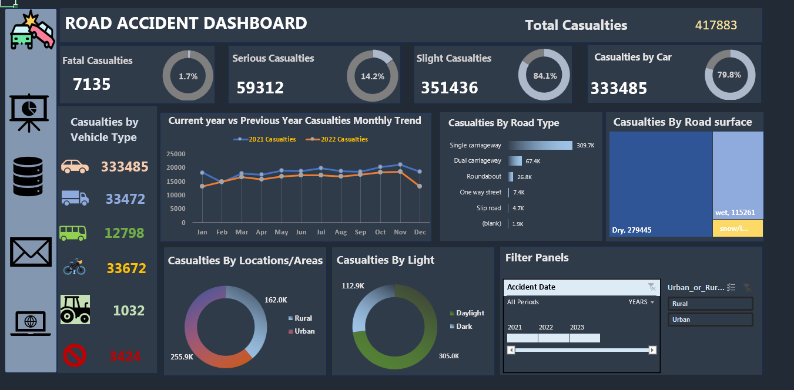

# Road-Accident-Dashboard

## Introduction
This project is an Excel-based analysis of road accidents using  data for the years 2021 and 2022. Road safety remains a critical global concern, affecting lives and infrastructure. To contribute to awareness and data-driven safety strategies, I developed a Road Accident Analytics Dashboard. This interactive dashboard is designed to provide valuable insights into accident trends, causes, and patterns, helping stakeholders make more informed decisions to improve road safety.

#### Disclaimer: The dataset and reportsdo not represent any company, institution or country, but just a dummy datasets to demonstrate capabilities of Excel.
## Problem Statement
This project focuses on analyzing road accident data to uncover key patterns and insights that can support road safety initiatives. Using data from 2021 and 2022, the objective is to identify high-impact areas by tracking casualty trends and breakdowns across several dimensions.
1. Primary KPIs:
   - Total Number of Casualties resulting from road accidents.

   - Casualty Severity Distribution: Breakdown into Fatal, Serious, and Slight casualties, along with their respective percentages of the total.

   - Highest Casualties by Vehicle Type: Identification of the vehicle type involved in the most casualties (e.g., Cars)
2. Secondary KPIs:
   - Total Casualties by Vehicle Type: Analysis across categories such as Cars, Buses, Vans, Bikes, Agricultural vehicles, and Others.
3. Trend Analysis:
   - Monthly Casualty Comparison: A side-by-side analysis of casualties by month for 2021 and 2022, helping identify patterns or anomalies across years.

4. Road Conditions & Environment:
   - Maximum Casualties by Road Type: Includes single/dual carriageways, roundabouts, slip roads, and one-way streets.

   - Casualties by Road Surface: Classification by surface condition (Dry, Wet, Snow/Ice) to understand environmental impacts.

   - Casualties by Area and Light Condition: Compares Urban vs Rural settings and Daylight vs Dark periods to highlight where and when most accidents occur.
     
## Skills Demonstrated
 - Data Cleaning & Transformation

 - Filtering & Conditional Logic

 - Pivot Tables & Charts

 - KPI Calculation

 - Interactive Dashboard Design

  - Data Visualization in Excel

  
## Stakaeholders
1. Ministry of transport
2. Road Transport Department
3. Police Force
4. Emergency Service Department
5. Road safety corps
6. Transport Operators
7. Traffic Management Agencies
8. Public
9. Media
    

## Metadata
File Extension: .xlsx
Number of Rows: 307,974
Number of Fields: 23

## Data Analysis
To enhance usability and provide a centralized overview, I created a dedicated "Data Analysis" sheet that consolidates key pivot tables for quick reference. This sheet serves as a valuable resource for users, developers, or clients to explore trends without needing to navigate the full dataset.This structured analysis enables users to quickly identify key patterns, monitor year-over-year trends, and assess factors contributing to higher accident rates.

 Below is a preview of the Data Analysis sheet as implemented in Excel
 

 ## Visualization:
Finally, the dashboard was created by inserting and customizing pivot charts based on the corresponding pivot tables. To ensure a user-friendly and interactive experience, slicers and timelines were incorporated. Hyperlinks and connections were also added to relevant icons for seamless navigation.

Below is a snippet of the final dashboard in Excel.

## Key Insights
📊 Total Casualties
A total of 417,883 casualties were recorded across 2021 and 2022.

📅 Monthly Trends

Casualties were slightly higher in 2021 than 2022.

October and November saw the highest casualty counts.

January and February had the lowest numbers.

🚗 Vehicle Type Impact

Cars were involved in nearly 80% of all casualties.

Other vehicle types (buses, vans, bikes, etc.) contributed minimally.

🩹 Accident Severity

Slight injuries accounted for 84.1% of casualties.

Fatal injuries made up only 1.7%.

🛣️ Road Type Breakdown

Single carriageways had the highest casualties (310,100).

Slip roads reported the fewest (5,100).

🌦️ Road Surface Conditions

Dry roads accounted for 67% of all casualties.

🏙️ Urban vs Rural

Urban areas experienced 61% of the total casualties.

🌞 Lighting Conditions

Daylight hours saw 73% of all recorded casualties.
## Recommendations
 - The dashboard’s comparison of casualty trends between the current and previous years on a monthly basis highlights October and November as critical periods. During these high-risk months, the traffic police and other stakeholders must intensify their road safety measures.
 - Car drivers account for the majority of casualties To address this, targeted awareness campaigns, strict monitoring, and periodic check-ups on safe driving practices are essential.
 - Enhanced safety measures are necessary on single carriageway roads, and these roads should be upgraded to double lanes wherever feasible.
By analyzing casualty distribution across different road surface conditions, the dashboard helps identify areas where road maintenance and surface improvements are crucial.
 - Urban areas require focused interventions to improve road safety, particularly during daytime.
## Conclusion
The Road Accident Analytics Dashboard empowers stakeholders with clear, data-driven insights to support informed decision-making. By highlighting critical patterns in accident severity, vehicle involvement, road conditions, and temporal trends, it serves as a powerful tool for policymakers, traffic authorities, and road safety advocates aiming to improve public safety.
Thank you for taking the time to explore this project.
💬 Your feedback is highly appreciated!
Feel free to connect with me for further discussion or collaboration.

 

 

     

